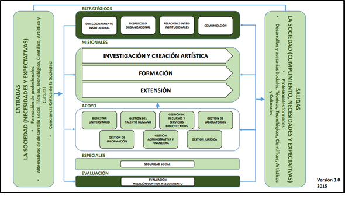
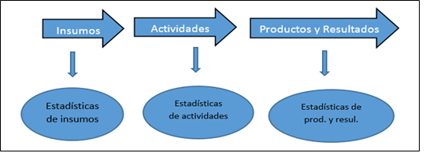
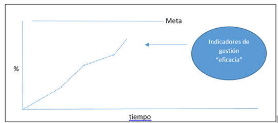
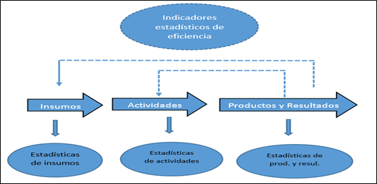
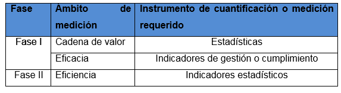

# Fases Desarrolladas

## 

* Selección de un proceso 
* Presentación "Documento Lineamientos""
* Construcción estadística (protocolo y gestión)
* Construcción indicador de gestión

# Estructura Documento Lineamientos

## 

* Consideraciones generales
* ¿Qué es un proceso y características de los procesos?
* Cuantificación y medición en los procesos
* Ámbitos de cuantificación y medición
* Gestión estadística de los procesos
* Referencias (bibliográficas y normativas)

# Consideraciones Generales

##

<p style="font-size:75%;"> 
Aunque es común hablar de la categoría de indicadores de efectividad. En la Universidad Nacional de Colombia se excluye este ámbito de medición en el marco de los procesos. La efectividad o impacto de los procesos se evalúa a través de estudios e investigaciones en donde los indicadores y estadísticas disponibles pueden ser uno de los mecanismos o instrumentos utilizados, pero no el único. 
</p>

<p style="font-size:75%;"> 
La madurez en la construcción de estadísticas e indicadores en el marco de un proceso se alcanza en el mediano y largo plazo. Para lograr este propósito, se debe agotar un número dado de pasos los cuales se sugiere sean abordados de manera secuencial. La construcción de buenas mediciones es un ejercicio de resistencia y no de velocidad.
</p>

# Qué es un proceso y características de los procesos?

##

<p style="font-size:90%;"> 
Según la Norma la Norma Técnica de Calidad en la Gestión Pública NTCGP 1000 y sus más reciente referente internacional la ISO 9001 Versión 2015, un proceso es entendido como un “conjunto de actividades mutuamente relacionadas o que interactúan para generar valor y las cuales transforman elementos de entrada en resultados”.
</p>

## Mapa de Macroprocesos de la Universidad Nacional de Colombia

<br>
 

# Cuantificación y medición en los procesos

## Estadísticas


<p style="font-size:70%;"> 
Las estadísticas son cifras de interés social e institucional las cuales se caracterizan, en el ámbito de lo público, principalmente por: ser construidas a partir  de información poblacional  disponible en registros administrativos y censos o inferida a través de estimaciones provenientes de muestras probabilísticas o no probabilísticas; permitir caracterizar/desagregar temporalmente, temáticamente y geográficamente rasgos de interés de los individuos que conforman las poblaciones  o muestras de interés; hacer uso conceptos, estándares y nomenclaturas internacionales, nacionales e institucionales que favorezcan su interpretación y comparación;  estar conformadas por cifras agregadas de naturaleza descriptiva derivadas de conteos o de mediciones; representar el presente y el pasado a través de la disposición de series de tiempo; ser susceptibles de ser representadas de manera tabular y gráfica (visualización); estar orientadas y delimitadas por normas; ser fácilmente interpretables y accesibles a través de múltiples mecanismos de disposición y divulgación; ser inclusivas; ser construidas a través de un proceso estadístico y finalmente, a partir de la comparación entre e intra poblaciones de las cifras agregadas, facilitar la creación de indicadores estadísticos.
</p>

##

* Población o muestra
*	Desagregaciones
*	Conceptos, estándares, clasificaciones y nomenclaturas
*	Medidas agregadas
* Series de tiempo
*	Representación tabular y gráficas
*	Normatividad
*	Transparencia y accesibilidad
*	Inclusivas
*	Proceso estadístico
*	Indicadores estadísticos


## Indicadores Estadísticos

<p style="font-size:70%;"> 
Los indicadores estadísticos conservan, en términos generales, los mismos atributos que las estadísticas, pero a diferencia de estas, este tipo de mediciones requieren de un trabajo técnico de mayor complejidad que el exigido en las estadísticas. Este tipo de mediciones sí requieren de fórmulas o de procedimientos metodológicos para efectos del cálculo de la medida de interés y pueden ser de naturaleza simple como las tasas, las razones y las proporciones o complejos como los índices y las escalas.
</p>

## Indicadores de Gestión (cumplimiento)

<p style="font-size:70%;"> 
Los indicadores de gestión, a diferencia de las estadísticas y los indicadores estadísticos, se caracterizan porque miden el cumplimiento de una expectativa o apuesta de futuro (meta) asociada a una política institucional o apuesta propuesta en el marco de un proceso. Para su construcción y medición se requiere la disposición de líneas de base y, dependiendo del tipo de meta a ser monitoreada, pueden ser de diferentes tipos: flujo, acumulación, capacidad, reducción, reducción por periodo, stock. 
</p>

## Tipos de indicadores de Gestión

* Indicadores de Flujo 
* Indicadores de Acumulación
* Indicadores de Capacidad
* Indicadores de Reducción
* Indicadores de Reducción por Periodo
* Indicadores de Stock

# Ámbitos de cuantificación y medición

## Cadena de Valor



## La Eficacia



## La Eficiencia



# Gestión estadística de los procesos

## Fases




# Gestión de Estadísticas e Indicadores Estadísticos

## 

 * Consolidación de poblaciones
 * Consolidación de información agregada
 * Representación tabular y gráfica
 * Disposición de información 

## Gráficos web para Estadísticas

* [Diag de barras](https://estadisticaun.github.io/Graficos/Series/J1_G2_I1_PEAMA_F5.html)

* [Tortas (Pie)](https://estadisticaun.github.io/Graficos/Series/J1_G2_I1_ADMITIDOS_F4.html)

* [Series de tiempo](https://estadisticaun.github.io/Graficos/Series/J1_G2_I1_ADMITIDOS_F16.html)

* [Tablas](https://estadisticaun.github.io/Graficos/Series/J1_G2_I1_ADMITIDO_F17.html)

* [Mapas](https://estadisticaun.github.io/Graficos/Mapas/municipios1.html)


# Gestión de los Indicadores de Gestión

##

* Definición de metas y líneas de base
* Definición de indicadores de gestión
* Medición y visualización
* Disposición de información


## Tipos de gráficos web Para Indicadores de Gestión

## Calibradores (Gauges)

```{r, echo=FALSE, warning=FALSE, message=FALSE}
library(rAmCharts)
p <- amAngularGauge(x = 25)
p
```


## Calibradores (Gauges)

```{r, echo=FALSE, warning=FALSE, message=FALSE}
library(rAmCharts)
p <- amSolidGauge(x = 65, text = "%", type = "semi")
p
```

## Gráficos de tiro (Bullets)

```{r, echo=FALSE, warning=FALSE, message=FALSE}
library(rAmCharts)
p <- amBullet(value = 50, val_color = "gray")
p
```


